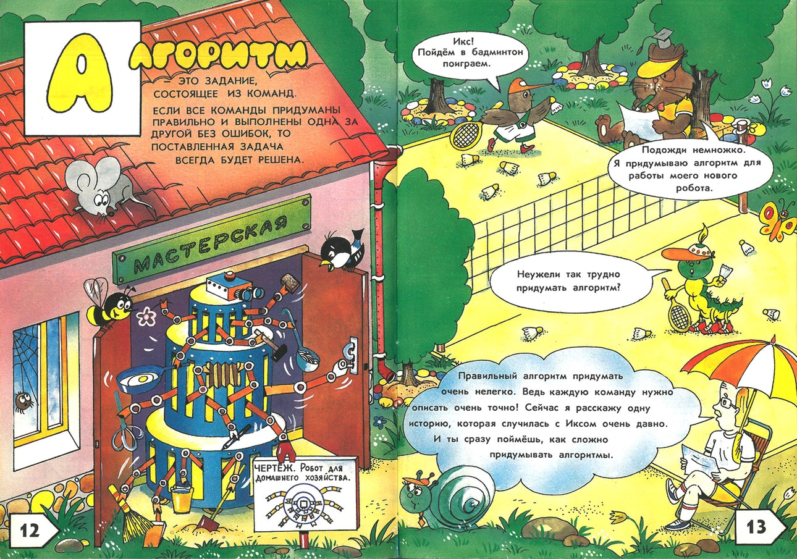
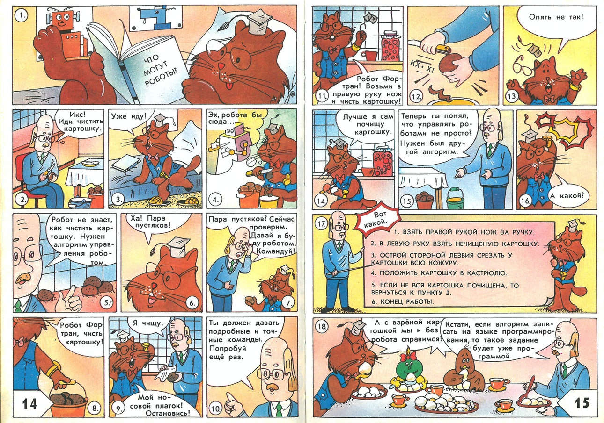

EngLang
=======

Interpreter for programming language in English.

Goal of this project is explore typesystem and grammar which allow write programs in English language.
Programs should be able to integrate with existing software development ecosystem, for example by accessing functions from dynamic libraries available on the system (.dll or .so).

Would be good to have this language compile not only to executables, but to dlls too. Which in itself can be used from other programming languages.

I will target initially .NET runtime, since I know it relatively well.
Other goal is to be able translate existing languages to this language. This is to support explanability of codebase to non-programmer.

I would choose English as example, since it has nice properties like articles. This allow disambiguate types from variables. I do not know what reasonable language trick [allow that](https://ru.wikipedia.org/wiki/%D0%90%D1%80%D1%82%D0%B8%D0%BA%D0%BB%D1%8C#%D0%A2%D0%B8%D0%BF%D1%8B_%D0%B0%D1%80%D1%82%D0%B8%D0%BA%D0%BB%D0%B5%D0%B9) in Russian/Ukrainian for example. If somebody know that I may pursue that language too.

Problems which I see with this kind of languages, is that software developers would oppose adoption of such language because it would not serve any practical purposes for engineering. I would say that any practical purposes would be in education maybe in understanding of the existing systems, gluing of the exising code (a.k.a no-code).
Reasons for that - most users cannot handle rigor required for automation. Reasons in Russian below: 



Other problem which I see is embedding of the well known data structures or formats in the language. This is closely resemble following samples when communicate with API for example. For example, how I would like to describe making API call to server in English?

Multiple domains can reuse same words, but with slightly specific meaning. Programming language should allow same names used within different context. Ideally you can mix concepts from different contexts.

## Ideas

How to declare variable: `an apple`. This is implicitly create variable `apple`. Let's say this is declaration of the variable. How to reference variable: `the apple`.

Interop with .NET
```
resolve a domain name ->
   call .NET Method `Dns.GetHostAddresses` with a domain name as parameter into the addresses.
```

it would be equivalent to following pseudo code.
```
resolve(domain_name):
    addresses = Dns.GetHostAddresses(domain_name)
```

Self-contained function which calculated Fibonacci number
```
Calculate factorial of a number ->
    if a number is 0 then result is 1.
    if a number is 1 then result is 1.
    let a previous number is a number minus 1.
    calculate factorial of a previous number into a previous factorial.
    result is a previous factorial multiply a number.
```

Maybe something more pythonnish
```
define the factorial of a number as
    if number is 0 then result is 1.
    result is a number times factorial of a number minus one.

let a number is factorial of 5
```
or 
```
define the factorial of a number as
    if number is 0 then result is 1.
    let a previous factorial be factorial of number minus one.
    result is a number times a previous factorial.

let a number is factorial of 5
```
or
```

to calculate the fibonacci of a number ->
   result is 1 if number is smaller 2.
   let a last be fibonacci of a number minus 1.
   let a one before last be fibonacci of a number minus 2.
   result is a last plus a one before last.
end
```

After looking at this sample it is not clear to me how 
- take reference to results of function execution.
- how define calculations into new variables. That's much easier to get right, but better be careful.
- Is functions are valid constructs for humans?

Implicit return of last expression (eventually, I cannot build linguistic construct which looks natural).
```
the width is a number.
the height is a number.

To calculate area from a width and a height ->
  result is multiply width to height.
```

Do language support concept of an expression in itself? How we decide that specific construct is expression, and what is statement.

### Determiners

Maybe I can use determiners like articles for English for variable specification.
What can I do for determiner-less languages like Russian(?). Have to research this article [5]

Alternative determiners looks promising.

## Sentences

The statements is sentence.

### Simple sentences

Statement is a sentnce which ends with `.`. Long sentences can be split by `;`, each part of this sentence will become their own sentence.

```
statement_1 ; statement_2 ; .... ; statement_N.
```

Preferably operate using linguistic properties, and do not use `;` if possible.

### Labeled sentences

Functions is labeled list of statements. 
```
Label_sentence_L1 ->
Label_sentence_L2 ->
  statement_1.
  statement_2.
  .....
  statement_3.
```

This label in itself will declare parameters, and specify how to execute call. The multiple labels can point to same set of sentences. That's allow for aliases for functions.

### Conditional execution

Conditional statement supports only constructs which can be considered `if..then` in other languages.

```
if XXXX is YYYY, operations_list.
```

### Arithmetics

It seems to be that math operations carried in usual language is quite interesting.

```
let a value equals 10
add 20 to a value
multiply a value by 42
```

Can be roughly translated to
```
let value = 10;
value += 20;
value *= 42;
```

This is not best way to write mathematical expression, but best way to validate calculations by humans without special training.

# Links
- [1] https://www.cs.cmu.edu/~jgc/Student%20Dissertations/1989-Jill%20Fain%20Lehman.pdf
- [2] https://github.com/pannous/english-script
- [3] http://inform7.com/doc/
- [4] https://en.wikipedia.org/wiki/Literate_programming
- [5] https://tspace.library.utoronto.ca/bitstream/1807/26223/1/Piriyawiboon_Nattaya_201011_PhD_thesis.pdf
